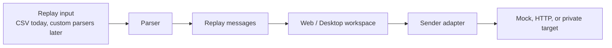
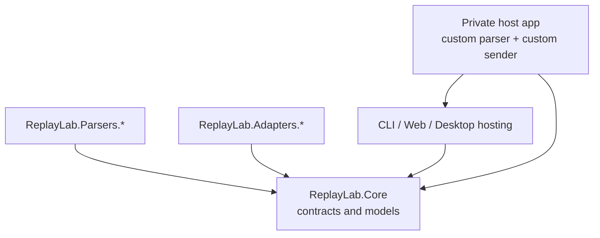
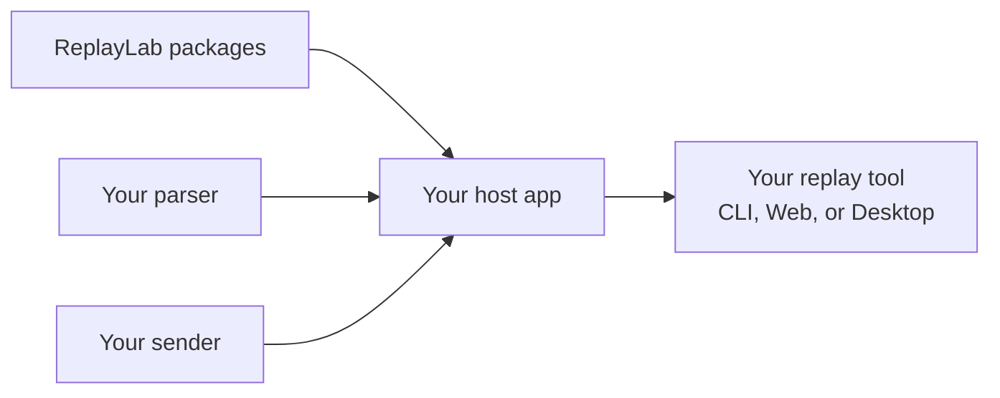

# ReplayLab

[](https://github.com/sebastienwitz/replaylab/actions/workflows/ci.yml)
[](https://github.com/sebastienwitz/replaylab/actions/workflows/release.yml)

[](LICENSE)
[](docs/roadmap.md)


ReplayLab is a .NET replay/testing toolkit for building local replay tools.

It helps developers load structured replay messages, inspect or edit them, and send them through configurable adapters. The long-term adoption goal is simple: reference ReplayLab packages, plug in your own parser or sender, and ship a Web or Desktop replay tool without forking this repository.



## Preview


## What you can do today

- Load CSV replay data.
- Inspect parsed messages in CLI or Web UI.
- Edit parsed values before replay in the Web workspace.
- Replay selected messages through mock or HTTP senders.
- Host ReplayLab CLI, Web, or Desktop surfaces from another .NET app.
- Build private parsers and senders outside this public repository.
- Run the Web UI in a native Desktop shell through Photino.NET.

## What ReplayLab is for

ReplayLab is for developers and technical operators who need a small local tool to exercise message flows, test adapters, or prepare replay scenarios.

It is intentionally generic. Public ReplayLab packages should stay reusable and free of business-specific concepts.



## What ReplayLab is not

ReplayLab is not a production replay platform yet.

It does not include:

- WCF or proprietary adapters;
- customer-specific payloads or mappings;
- certificates or private infrastructure concerns;
- persistence/session storage yet;
- Docker or installer assets;
- public NuGet.org publishing yet.

Those boundaries are deliberate. Private integrations belong in private solutions that reference ReplayLab.

## Quick start

### Requirements

- .NET SDK pinned by `global.json`.
- Windows, Linux, or macOS for CLI/Web.
- For Desktop:
  - Windows: Edge WebView2 runtime;
  - Linux: WebKitGTK;
  - macOS: system WebKit.

### Build and test

```powershell
dotnet restore ReplayLab.sln
dotnet build ReplayLab.sln --configuration Release --no-restore
dotnet test ReplayLab.sln --configuration Release --no-build
```

### Run the CLI

```powershell
dotnet run --project src/ReplayLab.Cli/ReplayLab.Cli.csproj -- samples/basic.csv
```

Use the HTTP sender preview:

```powershell
dotnet run --project src/ReplayLab.Cli/ReplayLab.Cli.csproj -- --sender http --endpoint-url http://localhost:5087/ samples/basic.csv
```

### Run the Web UI

```powershell
dotnet run --project src/ReplayLab.Web/ReplayLab.Web.csproj
```

### Run the Desktop app

```powershell
dotnet run --project src/ReplayLab.Desktop/ReplayLab.Desktop.csproj
```

## Build your own replay tool

The intended extension model is package/reference based:



Current path:

1. Reference `ReplayLab.Core`.
2. Implement `IMessageParser` if you need a custom input format.
3. Implement `IReplaySender` if you need a custom replay target.
4. Register your parser and sender **before** calling ReplayLab hosting extensions.
5. Host ReplayLab CLI/Web/Desktop surfaces from your app.

ReplayLab uses `TryAdd*` for default registrations, so consumer services registered first are preserved. See [docs/architecture.md](docs/architecture.md) for the full composition convention.

See `samples/CustomReplayTool/` for a working external-style sample that consumes
ReplayLab via `PackageReference` and composes a custom parser, sender, and Web host.

### GitHub Packages releases

ReplayLab SDK packages are published to GitHub Packages when a version tag is pushed.
Tags follow the pattern `v*.*.*`, with milestone-aligned preview conventions such as
`v0.13.0-preview.1`.

To consume packages from GitHub Packages, add the NuGet source:

```powershell
dotnet nuget add source "https://nuget.pkg.github.com/sebastienwitz/index.json" `
  --name github-replaylab `
  --username <github-username> `
  --password <github-token> `
  --store-password-in-clear-text
```

Then reference the packages in your project:

```xml
<PackageReference Include="ReplayLab.Core" Version="0.13.0-preview.1" />
```

GitHub Packages is the first package registry. NuGet.org publishing remains out of scope.

### Local NuGet packages

ReplayLab SDK projects can be packed locally and consumed from a local feed:

```powershell
./eng/pack-local.ps1
```

Packages are written to `artifacts/packages`. Verify restore and build:

```powershell
./eng/verify-local-packages.ps1
```

Package set:

- `ReplayLab.Core`
- `ReplayLab.Parsers.Csv`
- `ReplayLab.Adapters.Mock`
- `ReplayLab.Adapters.Http`
- `ReplayLab.Cli.Hosting`
- `ReplayLab.Web.Hosting`
- `ReplayLab.Desktop.Hosting`

GitHub Packages release automation is planned in M13. Public NuGet.org publishing remains out of scope. See [docs/roadmap.md](docs/roadmap.md).

## CSV support

`ReplayLab.Parsers.Csv` uses CsvHelper. It supports:

- quoted fields;
- escaped quotes;
- embedded commas;
- embedded newlines;
- blank lines;
- comment lines starting with `#`.

Current behavior:

- the first non-empty, non-comment record is treated as the header row;
- header names become JSON property names exactly as written;
- payload values are serialized as strings;
- each parsed row becomes one `ReplayMessage`;
- duplicate header handling, header normalization, and mapping configuration are deferred.

## Documentation map

| Topic | Link |
| --- | --- |
| Architecture | [docs/architecture.md](docs/architecture.md) |
| Roadmap | [docs/roadmap.md](docs/roadmap.md) |
| Packageable SDK plan | [docs/plans/m10-packageable-sdk.md](docs/plans/m10-packageable-sdk.md) |
| Hostable entry points | [docs/milestones/m7-hostable-entry-points.md](docs/milestones/m7-hostable-entry-points.md) |
| Extension model ADR | [docs/adr/0008-extension-model.md](docs/adr/0008-extension-model.md) |
| Hostable entry points ADR | [docs/adr/0009-hostable-entry-points.md](docs/adr/0009-hostable-entry-points.md) |
| Samples | [samples/README.md](samples/README.md) |
| Releases | [docs/releases.md](docs/releases.md) |

## Current status

Completed foundations:

- Core replay contracts and models.
- CSV parser.
- Sequential replay engine.
- Mock and HTTP adapters.
- CLI preview.
- Web UI.
- Hostable CLI/Web entry points.
- Desktop AppHost and reusable Desktop hosting seam.
- Editable replay workspace.
- Local NuGet packageability.
- External-style custom replay tool sample.

Next focus:

1. Harden SDK composition conventions for parser/sender overrides.
2. Prepare the next milestone-aligned preview release.
3. Keep local sessions/persistence deferred until SDK adoption and release automation are proven.