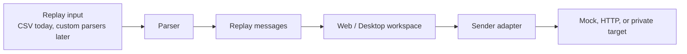
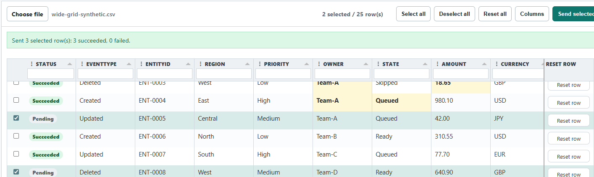
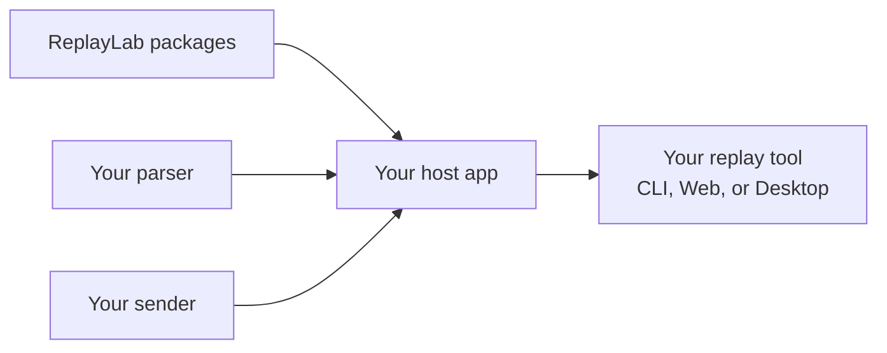

# ReplayLab

[](https://github.com/sebastienwitz/replaylab/actions/workflows/ci.yml)

[](LICENSE)
[](docs/roadmap.md)


ReplayLab is a .NET replay/testing toolkit for building local replay tools.

It helps developers load structured replay messages, inspect or edit them, and send them through configurable adapters. The long-term adoption goal is simple: reference ReplayLab packages, plug in your own parser or sender, and ship a Web or Desktop replay tool without forking this repository.



## Preview



## What you can do today

- Load CSV replay data.
- Inspect parsed messages in CLI or Web UI.
- Edit parsed values before replay in the Web workspace.
- Replay through mock or HTTP adapters.
- Host ReplayLab surfaces in your own app via DI composition.

## Quick start

### Run the CLI

```powershell
dotnet run --project src/ReplayLab.Cli/ReplayLab.Cli.csproj -- samples/basic.csv
```

### Run the Web UI

```powershell
dotnet run --project src/ReplayLab.Web/ReplayLab.Web.csproj
```

### Run the Desktop app

```powershell
dotnet run --project src/ReplayLab.Desktop/ReplayLab.Desktop.csproj
```

## Build your own replay tool

The intended extension model is package/reference based:



Current path:

1. Reference `ReplayLab.Core`.
2. Implement `IMessageParser` if you need a custom input format.
3. Implement `IReplaySender` if you need a custom replay target.
4. Register services through DI in your own composition root.
5. Host ReplayLab CLI/Web surfaces from your app.

### Local NuGet packages

ReplayLab SDK projects can be packed locally and consumed from a local feed:

```powershell
./eng/pack-local.ps1
```

Packages are written to `artifacts/packages`. Verify restore and build:

```powershell
./eng/verify-local-packages.ps1
```

Package set:

- `ReplayLab.Core`
- `ReplayLab.Parsers.Csv`
- `ReplayLab.Adapters.Mock`
- `ReplayLab.Adapters.Http`
- `ReplayLab.Cli.Hosting`
- `ReplayLab.Web.Hosting`

Public NuGet.org publishing remains out of scope. See [docs/plans/m10-packageable-sdk.md](docs/plans/m10-packageable-sdk.md).

## CSV support

`ReplayLab.Parsers.Csv` uses CsvHelper. It supports:

- quoted fields;
- escaped quotes;
- embedded commas;
- embedded newlines;
- blank lines;
- comment lines starting with `#`.

Current behavior:

- the first non-empty, non-comment record is treated as the header row;
- header names become JSON property names exactly as written;
- payload values are serialized as strings;
- each parsed row becomes one `ReplayMessage`;
- duplicate header handling, header normalization, and mapping configuration are deferred.

## Documentation map

| Topic | Link |
| --- | --- |
| Architecture | [docs/architecture.md](docs/architecture.md) |
| Roadmap | [docs/roadmap.md](docs/roadmap.md) |
| Packageable SDK plan | [docs/plans/m10-packageable-sdk.md](docs/plans/m10-packageable-sdk.md) |
| Hostable entry points | [docs/milestones/m7-hostable-entry-points.md](docs/milestones/m7-hostable-entry-points.md) |
| Extension model ADR | [docs/adr/0008-extension-model.md](docs/adr/0008-extension-model.md) |
| Hostable entry points ADR | [docs/adr/0009-hostable-entry-points.md](docs/adr/0009-hostable-entry-points.md) |
| Samples | [samples/README.md](samples/README.md) |

## Current status

Completed foundations:

- Core replay contracts and models.
- CSV parser.
- Sequential replay engine.
- Mock and HTTP adapters.
- CLI preview.
- Web UI.
- Hostable CLI/Web entry points.
- Desktop AppHost.
- Editable replay workspace.
- **Local NuGet packageability (M10A).**

Next focus:

1. Improve editable workspace UX.
2. Harden edited payload validation.
3. Add a NuGet-based custom replay tool sample (M10B).
4. Evaluate a reusable Desktop hosting seam.
