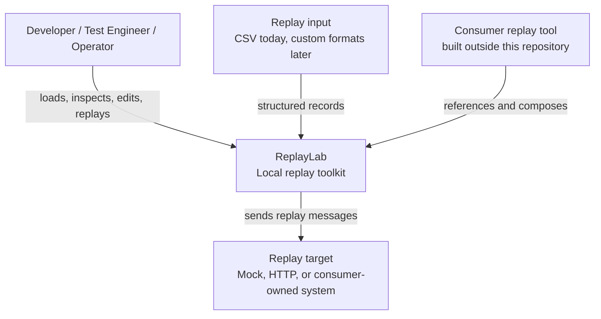
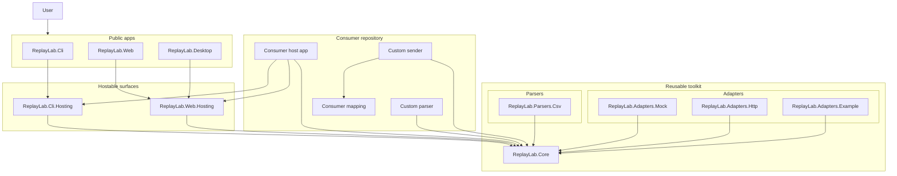
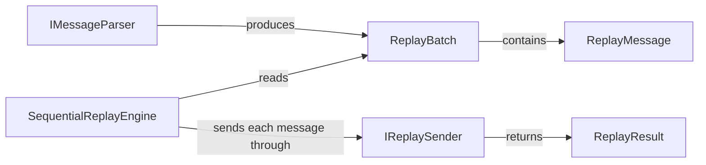
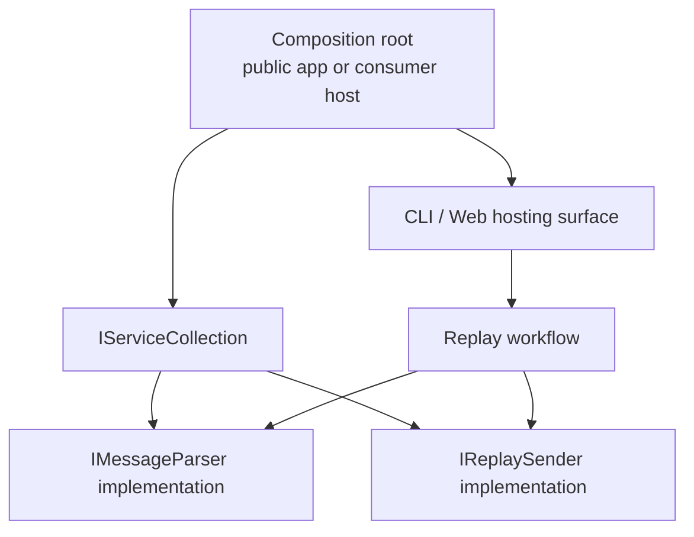
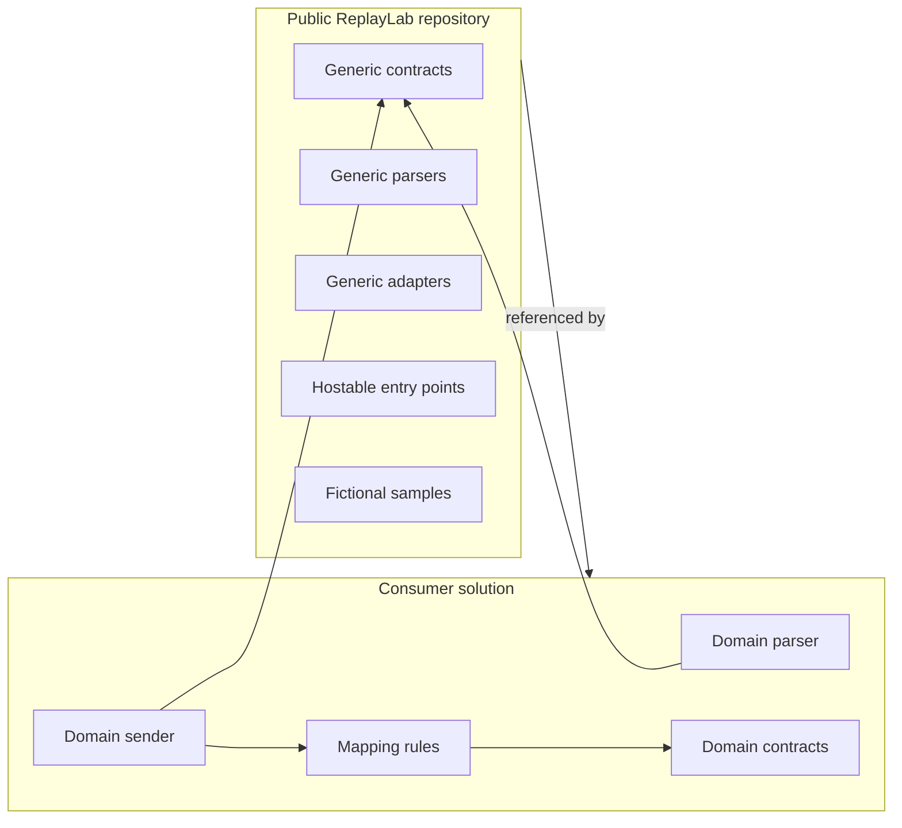
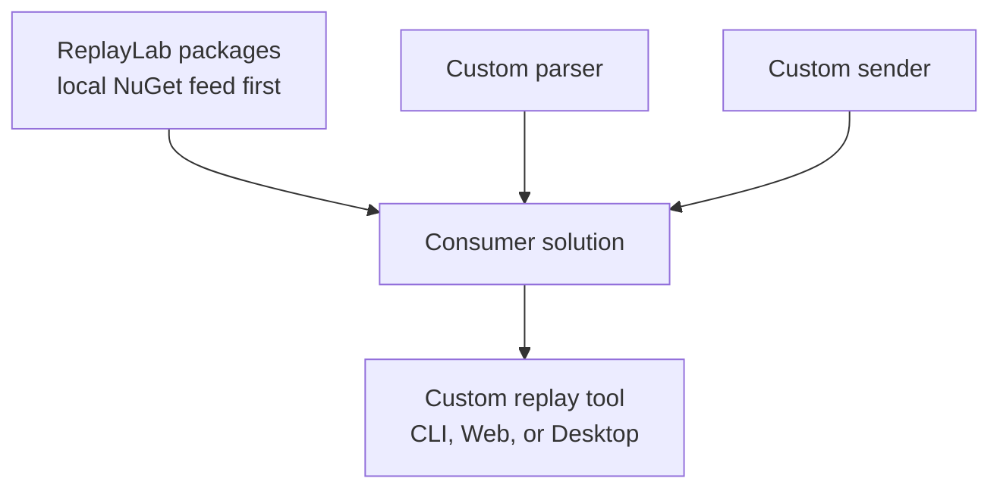

# ReplayLab Architecture

This document describes ReplayLab with a lightweight C4-style view.

ReplayLab is split between a reusable public toolkit and consumer applications. The public repository owns generic contracts, parsers, adapters, and hostable UI surfaces. Consumer applications own their own domain-specific parsers, senders, mappings, and deployment choices.

## C1 — System Context

ReplayLab provides the generic foundation: parse inputs, inspect and edit messages, replay selected rows, expose CLI/Web/Desktop entry points, and keep extension boundaries explicit.

## C2 — Containers

### Container notes

- `ReplayLab.Core` is the dependency root for public contracts and models.
- Parser and adapter projects depend on `ReplayLab.Core`, never the opposite.
- CLI, Web, and Desktop compose reusable hosting surfaces.
- Consumer hosts should own their own composition root.
- Consumer parser and sender implementations should stay outside the public repository.

## C3 — Core Components

| Component | Responsibility |
| --- | --- |
| `ReplayMessage` | Generic message envelope with id, payload, and headers. |
| `ReplayBatch` | Collection of parsed replay messages. |
| `ReplayResult` | Per-message replay outcome. |
| `IMessageParser` | Converts an input stream or file into a `ReplayBatch`. |
| `IReplaySender` | Sends one replay message to a target. |
| `SequentialReplayEngine` | Orchestrates sequential replay and collects results. |

## Hosting and Composition

ReplayLab favors static composition through .NET dependency injection.

The intended extension path is:

1. reference ReplayLab packages;
2. register a parser implementation;
3. register a sender implementation;
4. host CLI, Web, or Desktop behavior from the consumer app;
5. keep domain-specific mapping outside the public repo.

Dynamic plugin loading is not the default architecture. It can be revisited later if package/reference composition proves insufficient.

## Public / Consumer Boundary

The public repository may contain generic contracts, parsers, senders, local mock/test adapters, HTTP adapters, fictional samples, hostable entry points, and public documentation.

The public repository should not contain consumer-specific contracts, payloads, mappings, senders, operational assumptions, or real customer data.

## Package Consumption View

The M10A/M10B direction is to prove this flow locally before any public NuGet publishing:

- pack selected ReplayLab projects into `artifacts/packages`;
- restore them from an external-style sample through `PackageReference`;
- demonstrate custom parser/sender composition;
- keep publishing, signing, installer work, and dynamic plugins out of scope.

## Current Architectural Decisions

| Decision | Current stance |
| --- | --- |
| Core dependency direction | `ReplayLab.Core` must stay independent of parsers, adapters, UI, hosting, and consumer concerns. |
| Extension model | Prefer package/reference composition and DI registration. |
| Consumer adapters | Keep outside the public repo. |
| Desktop shell | Public `ReplayLab.Desktop` hosts the Web UI through Photino.NET. Reusable desktop hosting may be extracted later. |
| Persistence | Deferred until UX and package adoption are proven. |
| Dynamic plugins | Deferred until static composition proves insufficient. |

## Related Documentation

- [Roadmap](roadmap.md)
- [M10A Packageable SDK plan](plans/m10-packageable-sdk.md)
- [Extension model ADR](adr/0008-extension-model.md)
- [Hostable entry points ADR](adr/0009-hostable-entry-points.md)
- [Hostable entry points milestone](milestones/m7-hostable-entry-points.md)
