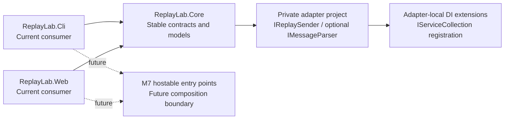
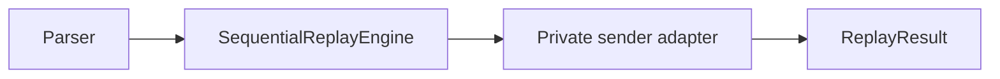

# M6: Private Adapter Extension Model

## Goal

Make it concretely possible for any developer to build a private ReplayLab
adapter outside the public repo by hardening the public contracts, providing DI
registration helpers in each adapter and parser project, adding a compilable
example adapter that proves the extension seam, and making `ReplayLab.Core`
packageable as a NuGet package.

M6 is the foundation that a private adapter author needs today. Hostable CLI
and Web entry points are deferred to M7.

## Status

Complete - M6 docs are finalized after issues #56, #57, #58, and #59. Core is
packageable and pack verified at version `0.6.0`; publication remains out of
scope.

## Planning Inputs

- Roadmap: `docs/roadmap.md` marks M6 as the Private Adapter Extension Model
  milestone and M7 as Hostable Entry Points.
- PRD: `docs/prd/0004-sender-adapters.md` explicitly reserves private adapters
  for outside the public repo.
- PRD: `docs/prd/0007-packaging.md` defines packaging expectations and notes
  that packaging should not precede public contract review.
- Architecture decisions:
  - `docs/adr/0002-separate-core-from-adapters.md`
  - `docs/adr/0004-architecture-style.md`
- Prior milestone learning:
  - `docs/retrospectives/m5-minimal-web-ui.md` recommends M6 remain
    documentation-focused but the updated scope adds concrete implementation to
    prove the extension seam.

## PRD-Light Summary

### Users

- Developers who need to build a private WCF, messaging, or business-specific
  sender adapter against the public ReplayLab contracts.
- Teams who want to extend ReplayLab without forking or modifying the public
  repo.
- Contributors checking that the public extension surface is clean and generic.

### Outcomes

- Public contracts in `ReplayLab.Core` are reviewed and hardened. Breaking
  changes are accepted where they make the extension seam cleaner.
- Each adapter and parser project exposes `IServiceCollection` extension methods
  so private projects can register ReplayLab components in their own DI
  container.
- `ReplayLab.Adapters.Example` ships as a thin, fictional, compilable sender
  adapter (`FileReplaySender`) with tests, proving the extension seam works
  end-to-end.
- `ReplayLab.Core` is packageable and pack verified. A private project can add a
  `<PackageReference>` and implement `IReplaySender` without cloning this repo.
- An extension guide, ADR, and PRD document the public contracts, DI
  registration pattern, and composition boundaries.

### Non-Goals

- WCF, proprietary contracts, or business-specific mapping code in this repo.
- Hostable CLI or Web entry points (deferred to M7).
- NuGet publishing for `ReplayLab.Cli` or `ReplayLab.Web` (M7).
- AppHost or desktop entry point (M7 or later).
- Authentication, persistence, Docker, or deployment changes.
- Broad parser or CLI redesign.

### Constraints

- `ReplayLab.Core` must remain independent from adapters, CLI, Web, and
  business-specific concerns after hardening.
- DI helpers live in each adapter/parser project, not in Core. Core must not
  gain a dependency on `Microsoft.Extensions.DependencyInjection`.
- The example adapter is fictional — no network calls, no business logic, no
  WCF.
- Breaking changes to public contracts must be recorded in ADR 0008.
- NuGet packaging uses standard `.csproj` metadata. No custom tooling.

### Success Criteria

- `dotnet test ReplayLab.sln` passes after all M6 changes.
- A private project can add `<PackageReference Include="ReplayLab.Core" />`
  and implement `IReplaySender` without cloning this repo.
- `ReplayLab.Adapters.Example` compiles, its tests pass, and it depends only on
  `ReplayLab.Core`.
- Each adapter and parser project exposes at least one `IServiceCollection`
  extension method.
- ADR 0008 records all breaking changes and extension model decisions.
- The extension guide describes how to build a private adapter from scratch.

## ADR Candidates

- `docs/adr/0008-extension-model.md` records the public extension points,
  breaking contract changes, DI registration pattern, NuGet packaging scope,
  and composition boundaries for private adapters.

## Vertical Slices

### Slice 1: Harden Public Contracts

Review `ReplayLab.Core` contracts. Fix casing inconsistencies, nullable
ambiguity, and constructor vs init confusion. Evaluate whether
`SequentialReplayEngine` belongs in Core or a composition layer. Record all
breaking changes in ADR 0008.

### Slice 2: Add DI Registration Helpers

Add `IServiceCollection` extension methods to `ReplayLab.Adapters.Mock`,
`ReplayLab.Adapters.Http`, and `ReplayLab.Parsers.Csv`. Each project registers
its own components. Core does not gain a DI dependency.

### Slice 3: Add Example Adapter

Add `src/ReplayLab.Adapters.Example` with `FileReplaySender` implementing
`IReplaySender`. Add `tests/ReplayLab.Adapters.Example.Tests`. Add both to
`ReplayLab.sln`. Include DI registration in the example project.

### Slice 4: NuGet Packaging For Core

Add NuGet metadata to `ReplayLab.Core.csproj`. Verify `dotnet pack` produces a
valid package. Document the consumption model (project reference vs NuGet) in
the extension guide.

### Slice 5: Write Extension Guide And Docs

Write the extension guide section inside this milestone doc. Update
`docs/adr/0008-extension-model.md` to reflect all actual decisions made in
Slices 1–4. Update `docs/prd/0008-private-adapter-extension-model.md` if
needed. Include architecture diagram (Core as stable hub, private adapter
depending only on Core) and flow diagram (parser → engine → private adapter →
result).

Note: ADR 0008 and PRD 0008 are created in the planning PR as proposed docs.
The extension guide and diagram content are produced as part of this slice,
after implementation is complete.

## Issue Drafts

### Draft 1: Harden ReplayLab.Core public contracts

**Goal:** Review and clean up all public contracts in `ReplayLab.Core` so the
extension surface is unambiguous before external adopters depend on it.

**Scope:**

- Audit `IReplaySender`, `IMessageParser`, `ReplayMessage`, `ReplayResult`,
  `ReplayResultStatus`, `ReplayBatch`, and `SequentialReplayEngine`.
- Fix casing inconsistency in `ReplayResult` constructor parameters
  (`exceptionType` vs `ExceptionType`).
- Resolve constructor vs `init` ambiguity in `ReplayResult`.
- Clarify nullable intent for `Headers` and `Metadata` on `ReplayMessage`.
- Decide whether `SequentialReplayEngine` belongs in `ReplayLab.Core` or should
  move to a composition layer.
- Record all breaking changes in ADR 0008.

**Acceptance Criteria:**

- All public types in `ReplayLab.Core` have consistent naming and clear
  nullability intent.
- `ReplayResult` can be constructed without ambiguity.
- `SequentialReplayEngine` placement is decided and recorded in ADR 0008.
- `dotnet test ReplayLab.sln` passes after changes.
- Existing CLI, Web, and adapter behavior is updated to match any breaking
  changes.

**Linked Docs or ADRs:**

- `docs/adr/0002-separate-core-from-adapters.md`
- `docs/adr/0008-extension-model.md` (to be created)
- `docs/prd/0001-core-replay-model.md`
- `docs/milestones/m6-private-adapter-extension-model.md`

**Implementation Notes:**

- Treat this as a targeted cleanup pass, not a broad redesign.
- If `SequentialReplayEngine` moves out of Core, keep it in a new
  `ReplayLab.Engine` project or in the composition layer of CLI/Web.
- Update all projects that reference changed types.

**Test Expectations:**

- Run `dotnet build ReplayLab.sln` and `dotnet test ReplayLab.sln` after each
  breaking change.
- No new test projects needed — verify existing tests still pass.

**Risks:**

- Breaking changes could cascade into CLI, Web, and adapter projects more than
  expected.
- Moving `SequentialReplayEngine` could require non-trivial DI wiring changes
  in CLI and Web.

**Out Of Scope:**

- DI helpers.
- Example adapter.
- NuGet packaging.
- New public types not needed for the extension seam.

---

### Draft 2: Add DI registration helpers to adapter and parser projects

**Goal:** Let private projects register ReplayLab components in their own DI
container using standard `IServiceCollection` extension methods.

**Scope:**

- Add `AddMockReplaySender(this IServiceCollection)` to
  `ReplayLab.Adapters.Mock`.
- Add `AddHttpReplaySender(this IServiceCollection, ...)` to
  `ReplayLab.Adapters.Http`.
- Add `AddCsvMessageParser(this IServiceCollection)` to
  `ReplayLab.Parsers.Csv`.
- Add `AddSequentialReplayEngine(this IServiceCollection)` wherever
  `SequentialReplayEngine` lands after Slice 1.
- Each extension method lives in its own project. Core does not gain a DI
  dependency.

**Acceptance Criteria:**

- A project can register all ReplayLab components with a standard
  `services.Add*` call.
- Core has no reference to `Microsoft.Extensions.DependencyInjection` or its
  abstractions.
- Each adapter and parser project references only
  `Microsoft.Extensions.DependencyInjection.Abstractions` (not the full
  package).
- `dotnet test ReplayLab.sln` passes.

**Linked Docs or ADRs:**

- `docs/adr/0008-extension-model.md`
- `docs/milestones/m6-private-adapter-extension-model.md`

**Implementation Notes:**

- Use `Microsoft.Extensions.DependencyInjection.Abstractions` only — not the
  full `Microsoft.Extensions.DependencyInjection` package.
- Keep extension methods thin: register the type, nothing more.
- Update CLI and Web startup to use the new extension methods where appropriate.

**Test Expectations:**

- Add a simple registration smoke test per project verifying the service
  resolves correctly.
- Run `dotnet test ReplayLab.sln`.

**Risks:**

- If `SequentialReplayEngine` placement is not resolved in Slice 1, this slice
  is blocked on that decision.

**Out Of Scope:**

- DI helpers in Core.
- Configuration DSL or options pattern (can be added per adapter in a follow-up
  if needed).
- Example adapter registration (covered in Draft 3).

---

### Draft 3: Add ReplayLab.Adapters.Example with FileReplaySender

**Goal:** Prove the extension seam end-to-end with a compilable, fictional
sender adapter that depends only on `ReplayLab.Core`.

**Scope:**

- Create `src/ReplayLab.Adapters.Example/ReplayLab.Adapters.Example.csproj`
  referencing only `ReplayLab.Core`.
- Implement `FileReplaySender` — writes one line per message to a local text
  file, returns a `ReplayResult`.
- Add `AddExampleReplaySender(this IServiceCollection)` extension method.
- Create `tests/ReplayLab.Adapters.Example.Tests/` with focused sender tests.
- Add both projects to `ReplayLab.sln`.

**Acceptance Criteria:**

- `ReplayLab.Adapters.Example` depends only on `ReplayLab.Core` and
  `Microsoft.Extensions.DependencyInjection.Abstractions`.
- `FileReplaySender` implements `IReplaySender` and its tests pass.
- DI registration extension method exists and resolves the sender correctly.
- `dotnet test ReplayLab.sln` passes.
- No business logic, WCF, HTTP, network calls, or proprietary references.

**Linked Docs or ADRs:**

- `docs/adr/0008-extension-model.md`
- `docs/prd/0004-sender-adapters.md`
- `docs/milestones/m6-private-adapter-extension-model.md`

**Implementation Notes:**

- Keep `FileReplaySender` as simple as possible — the goal is to prove the
  interface, not to build a useful file adapter.
- The example is explicitly labelled as an extension pattern reference, not a
  production adapter.

**Test Expectations:**

- Test that `FileReplaySender.SendAsync` returns a successful `ReplayResult`.
- Test that the written file contains the expected message content.
- Test that DI registration resolves `IReplaySender` to `FileReplaySender`.

**Risks:**

- The example could grow beyond its purpose if reviewers expect a
  production-quality adapter.

**Out Of Scope:**

- HTTP, WCF, database, or network sending.
- Configuration or options.
- Multiple example adapters.
- AppHost or desktop integration.

---

### Draft 4: Add NuGet packaging metadata to ReplayLab.Core

**Goal:** Make `ReplayLab.Core` packageable as a NuGet package so private
projects can reference it without cloning this repo.

**Scope:**

- Add `<PackageId>`, `<Version>`, `<Authors>`, `<Description>`,
  `<RepositoryUrl>`, and `<PackageTags>` to `ReplayLab.Core.csproj`.
- Verify `dotnet pack ReplayLab.Core` produces a valid `.nupkg`.
- Document the intended consumption model in the extension guide: project
  reference for local development, NuGet reference for private adapter projects.
- Do not publish to NuGet.org in this issue — publishing is a separate
  operational step.

**Acceptance Criteria:**

- `dotnet pack src/ReplayLab.Core` succeeds and produces a `.nupkg`.
- The package metadata is complete and accurate.
- `dotnet test ReplayLab.sln` still passes.
- The extension guide describes how to add a `<PackageReference>` to a private
  project.

**Linked Docs or ADRs:**

- `docs/adr/0008-extension-model.md`
- `docs/prd/0007-packaging.md`
- `docs/milestones/m6-private-adapter-extension-model.md`

**Implementation Notes:**

- Use SemVer. Start at `1.0.0` or align with the team's versioning preference.
- Consider adding a `Directory.Build.props` with shared metadata if more
  packages follow in M7.
- Do not add packaging metadata to CLI or Web in this issue (M7 scope).

**Test Expectations:**

- Manual verification: `dotnet pack` produces a valid package.
- No automated pack tests needed for M6.

**Risks:**

- Choosing a version number implies a public API stability commitment. Make this
  explicit in ADR 0008.

**Out Of Scope:**

- Publishing to NuGet.org or GitHub Packages.
- Packaging CLI, Web, parsers, or adapters (M7).
- CI/CD pipeline changes.
- Multi-targeting.

---

### Draft 5: Write extension guide, ADR 0008, and PRD 0008

**Goal:** Document the private adapter extension model so any developer can
understand the public contracts, DI registration pattern, composition
boundaries, and how to get started with a private adapter.

**Scope:**

- Write `docs/adr/0008-extension-model.md` recording: public extension points,
  all breaking changes from Slice 1, DI registration pattern decision, NuGet
  packaging scope, and composition boundaries.
- Write `docs/prd/0008-private-adapter-extension-model.md` defining users,
  outcomes, constraints, and success criteria for the extension model.
- Add an extension guide section to this milestone doc including:
  - Architecture diagram: `ReplayLab.Core` as the stable hub, private adapter
    project depending only on Core, CLI/Web as composition examples.
  - Flow diagram: parser → engine → private adapter → result.
  - Step-by-step narrative: how to start a private adapter project, reference
    Core, implement `IReplaySender`, register via DI, and compose with the
    engine.
- Update `docs/roadmap.md` to reflect the M6/M7 split.

**Acceptance Criteria:**

- ADR 0008 is complete and records all M6 architecture decisions.
- PRD 0008 is complete.
- The extension guide is clear enough for a developer unfamiliar with the repo
  to follow without additional explanation.
- Architecture and flow diagrams are present (ASCII or Mermaid).
- Roadmap reflects M7 as Hostable Entry Points.

**Linked Docs or ADRs:**

- `docs/adr/0002-separate-core-from-adapters.md`
- `docs/adr/0004-architecture-style.md`
- `docs/prd/0004-sender-adapters.md`
- `docs/milestones/m6-private-adapter-extension-model.md`

**Implementation Notes:**

- Write the guide after Slices 1–4 are complete so it reflects actual
  decisions, not planned ones.
- Use Mermaid diagrams if the repo's markdown renderer supports them; otherwise
  use ASCII.

**Test Expectations:**

- No code tests. Review that all links in the docs resolve correctly.

**Risks:**

- Writing the guide before contract hardening is complete could produce
  inaccurate docs.

**Out Of Scope:**

- M7 documentation.
- WCF or business-specific extension guidance.
- Packaging or CI/CD docs beyond what M6 delivers.

## Recommended Sequence

1. Harden public contracts (Draft 1) — everything else depends on stable
   contracts.
2. Add DI registration helpers (Draft 2) — unblocked after contract decisions.
3. Add example adapter (Draft 3) — proves the seam with real code.
4. Add NuGet packaging metadata to Core (Draft 4) — low risk, depends on
   stable contracts.
5. Write extension guide and docs (Draft 5) — written last to reflect actual
   decisions.

## Extension Guide

### Architecture

M6-supported private adapter projects depend on `ReplayLab.Core` and, where
needed, `Microsoft.Extensions.DependencyInjection.Abstractions` for their own
registration helpers. They own their composition root in M6. CLI and Web remain
current repo consumers in M6 and are the items that become hostable entry points
in M7.

### Flow

### How To Start A Private Adapter

1. Create a private class library project outside this repository.
2. Add a reference to `ReplayLab.Core`.
   - During local development: `<ProjectReference Include="..\ReplayLab.Core\ReplayLab.Core.csproj" />`
   - In a private consumer project: `<PackageReference Include="ReplayLab.Core" Version="0.6.0" />`
3. Implement `IReplaySender` and, if needed, `IMessageParser`.
4. Add a project-local `IServiceCollection` extension method to register the adapter.
5. Resolve `SequentialReplayEngine` from the container and drive replay through the private adapter.
6. Keep CLI and Web composition out of scope until M7 hostable entry points are introduced.

### Boundary Rules

- `ReplayLab.Core` stays generic and dependency-light.
- DI helpers stay in adapter/parser projects, not in Core.
- Packageable means `dotnet pack` works; it does not mean publication happened.
- M7 is the place for hostable CLI/Web entry points, not this milestone.
