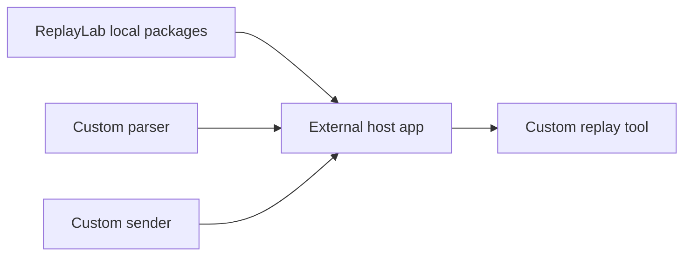
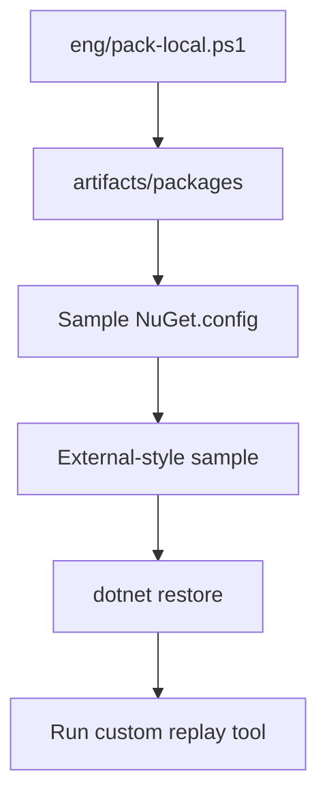

# M10A Packageable ReplayLab SDK Plan

**Status:** Implemented. Package metadata, local pack script, and verification are in place.

## Goal

Make ReplayLab consumable by external .NET solutions through local NuGet packages.

A developer should be able to reference ReplayLab packages, provide custom parsers and senders, and ship a small replay tool without forking this repository.

## Why this matters

ReplayLab's strongest adoption path is not only the built-in CLI, Web UI, or Desktop shell. The stronger value is that another developer can compose their own replay tool quickly:



This milestone proves the package/reference workflow locally before any public NuGet publishing commitment.

## Success criteria

M10A is successful when:

- selected ReplayLab projects can be packed into `artifacts/packages`;
- an external-style project can restore those packages from a local feed;
- package metadata is consistent enough for local consumption;
- the public/private adapter boundary remains intact;
- the package set is documented clearly;
- public NuGet publishing remains explicitly out of scope.

## Candidate package set

| Package | Purpose | Notes |
| --- | --- | --- |
| `ReplayLab.Core` | Contracts and replay models | Already packageable and pack verified. |
| `ReplayLab.Parsers.Csv` | Default CSV parser | Depends on Core and CsvHelper. |
| `ReplayLab.Adapters.Mock` | Local/default sender | Useful for tests and demos. |
| `ReplayLab.Adapters.Http` | Generic HTTP sender | Public protocol adapter. |
| `ReplayLab.Cli.Hosting` | Reusable CLI host surface | For external CLI tools. |
| `ReplayLab.Web.Hosting` | Reusable Web host surface | Needs care because of Razor/static assets and default services. |
| `ReplayLab.Desktop.Hosting` | Optional reusable desktop host surface | Evaluate in #101 before committing to this package. |

`ReplayLab.Desktop` itself should probably remain an executable app. If external desktop composition needs to be packageable, extract reusable bootstrap code into a library instead of packaging the app directly.

## Local feed workflow



### Produce local packages

```powershell
./eng/pack-local.ps1
```

Optional configuration:

```powershell
./eng/pack-local.ps1 -Configuration Release
```

The script packs the selected projects and writes `.nupkg` files to `artifacts/packages`.

### Verify local feed restore

```powershell
./eng/verify-local-packages.ps1
```

The script creates a temporary verification project with a local `NuGet.config` pointing to `artifacts/packages`, references the ReplayLab packages via `PackageReference`, and confirms `dotnet restore` and `dotnet build` succeed.

Both `artifacts/packages` and the temporary verification folder are ignored by git.

## Work breakdown

### 1. Normalize package metadata

Add or align package metadata for selected projects:

- `PackageId`
- `Version`
- `Authors`
- `Description`
- `RepositoryUrl`
- `PackageTags`
- `PackageLicenseExpression`

Shared metadata lives in `Directory.Build.props`:

- `Version`
- `Authors`
- `RepositoryUrl`
- `PackageLicenseExpression`

Project-specific metadata (`PackageId`, `Description`, `PackageTags`) lives in each `.csproj`.

### 2. Add local pack script

`eng/pack-local.ps1`:

- packs the selected package projects;
- outputs packages to `artifacts/packages`;
- fails fast when a package is missing;
- avoids publishing anywhere.

### 3. Verify package restore

`eng/verify-local-packages.ps1` creates a temporary external-style project with a `NuGet.config` pointing to `artifacts/packages`.

Verification proves that `PackageReference` works without project references back into the ReplayLab source tree.

### 4. Document the package workflow

Document:

- which packages are currently produced;
- how to run the local pack script;
- how to consume packages from the local feed;
- what remains out of scope.

Keep README short. Put detailed package workflow documentation in a dedicated doc or the M10B sample README.

## Dependency on M10B

M10A prepares the packages. M10B proves the consumer story with a real external-style sample.

M10B should not use project references to ReplayLab source projects. It should use `PackageReference` and a local feed to simulate the real consumer experience.

## Related issues

- #99 — Package ReplayLab SDK for local NuGet consumption
- #100 — Add NuGet-based custom replay tool sample
- #101 — Extract reusable Desktop hosting seam

## Out of scope

- Publishing to nuget.org.
- Package signing.
- Release automation.
- Installer creation.
- Dynamic plugin loading.
- Private/WCF/business-specific adapters.
- Customer-specific payload examples.

## Risks and decisions

| Risk / decision | Why it matters | Expected handling |
| --- | --- | --- |
| `ReplayLab.Web.Hosting` packaging | Razor/static assets can be more subtle than class libraries. | Verify package restore and runtime behavior with a sample. |
| Desktop package shape | Packaging the executable app directly is likely the wrong abstraction. | Evaluate `ReplayLab.Desktop.Hosting` in #101. |
| Metadata drift | Multiple packages can diverge quickly. | Centralize shared metadata where practical. |
| Premature public publishing | Public NuGet creates versioning/support expectations. | Keep M10A local-only. |
| Plugin overengineering | Static DI composition may be enough. | Defer dynamic plugin loading until after M10B validates the simple path. |

## Definition of done

- [x] `eng/pack-local.ps1` creates the selected packages in `artifacts/packages`.
- [x] Package metadata is consistent across selected projects.
- [x] At least one external-style restore test proves local package consumption.
- [x] Documentation explains the local package workflow.
- [x] No public publishing, signing, or release automation is introduced.
